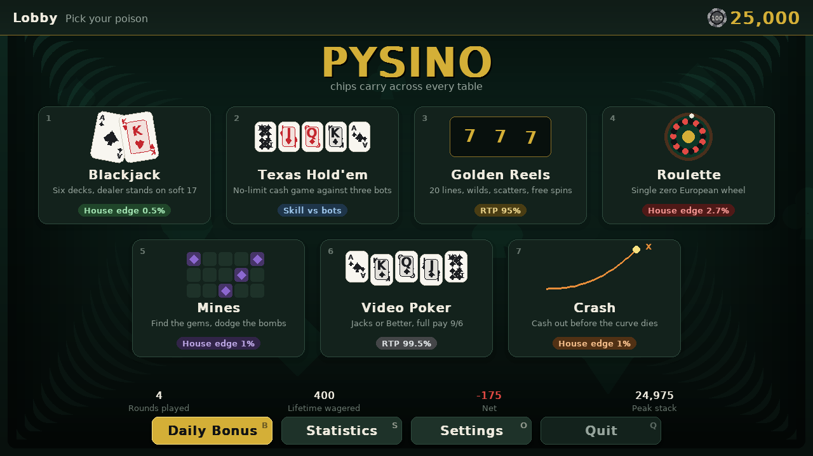
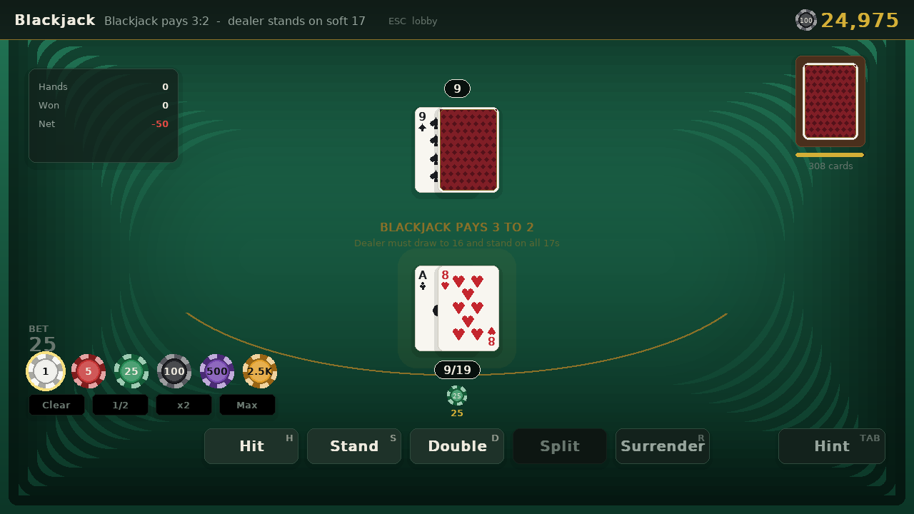
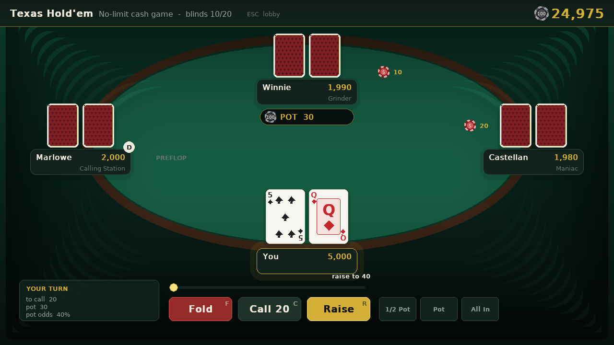
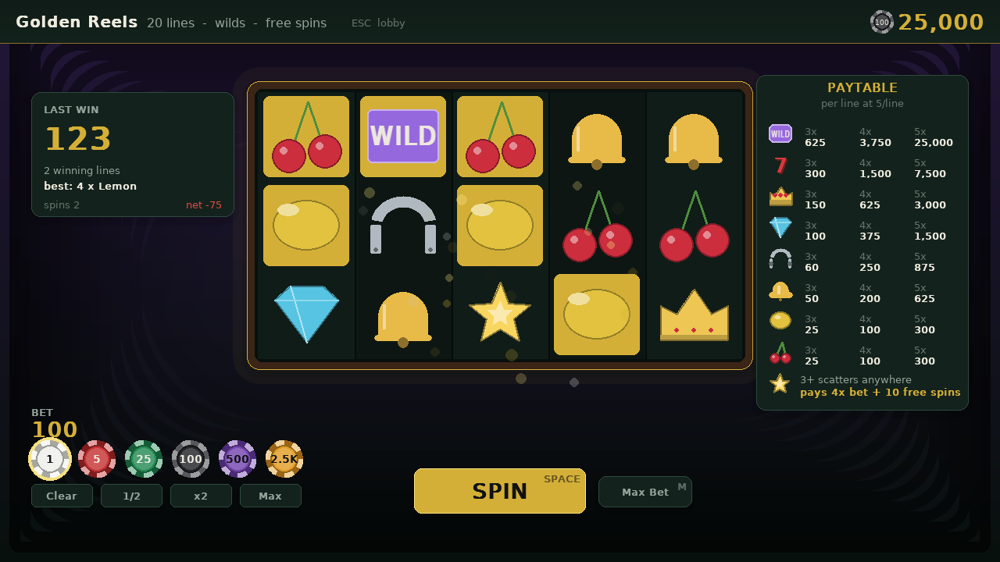
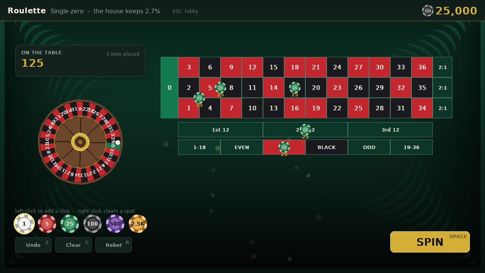
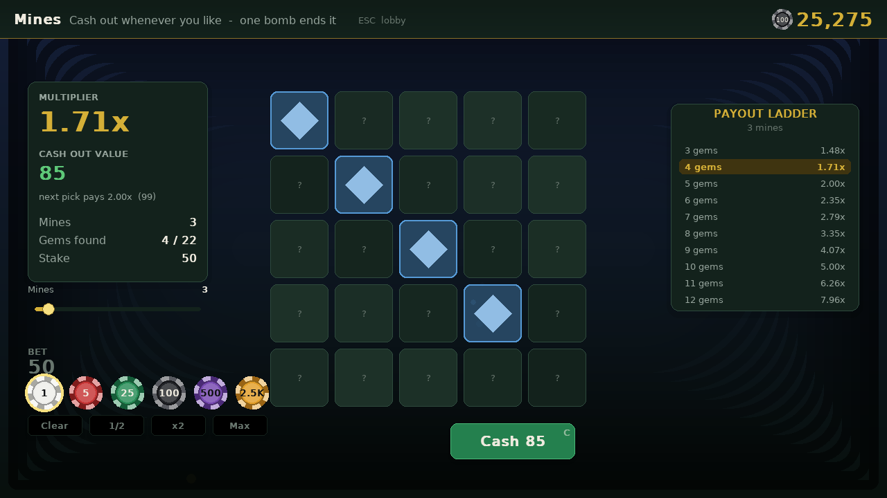
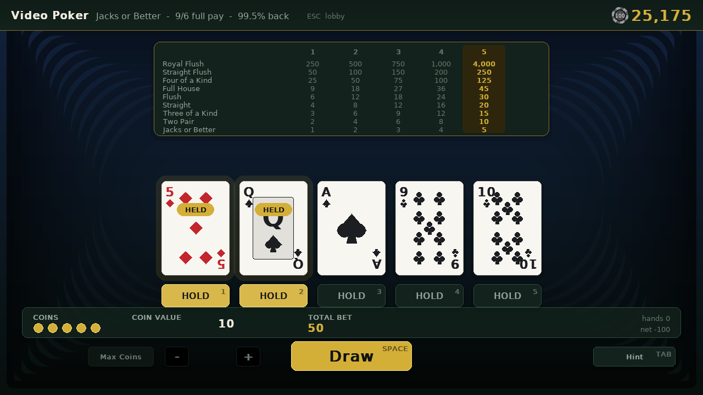
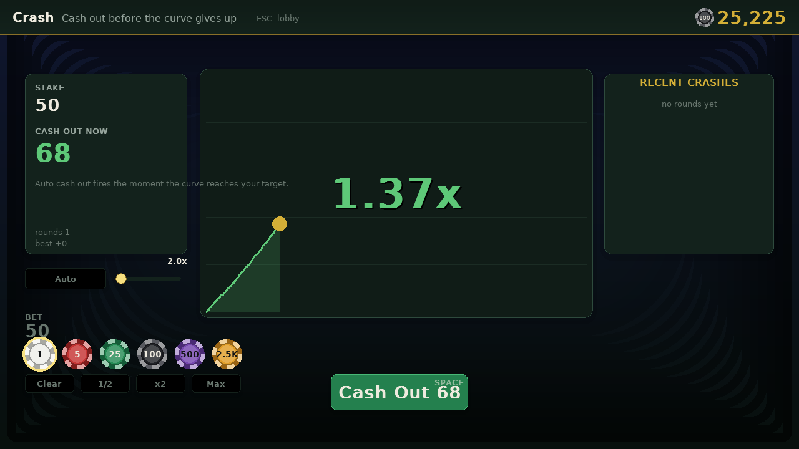

# Pysino

A casino arcade in Python and pygame. Seven games, one chip stack, no real money
and no gambling — the chips are pretend and there is no way to buy them.



Your chips are the whole point: win them at the blackjack table, lose them on
the slots, and take whatever is left to the poker game. One bankroll follows you
everywhere and is saved between sessions along with your statistics.

The game ships with **no asset files**. Every playing card, chip, slot symbol and
roulette wheel is drawn with `pygame.draw` at runtime, and all the sound effects
are synthesised as raw PCM the first time they are played.

---

## Running it

```bash
pip install -r requirements.txt
python run.py
```

Python 3.9+ and `pygame-ce` are the only requirements.

```bash
python run.py --scene slots     # jump straight to a table
python run.py --fullscreen
python run.py --reset           # wipe the saved profile first
```

The window is resizable and `F11` toggles fullscreen. The game renders to a
fixed 1280×720 canvas that is scaled and letterboxed into whatever size you
choose, so nothing reflows or clips.

---

## Playing it in a browser

Two genuinely different ways to do this, depending on what you want:

### Replit — an actual IDE, zero setup

The straightforward option if you want to open it, hit Run, and play, without
installing Python locally.

1. [replit.com](https://replit.com) → **Create Repl** → **Import from GitHub**
   → paste this repo's URL.
2. Replit detects Python from `requirements.txt` and installs `pygame-ce`
   automatically.
3. Hit **Run**. A `.replit` file in the repo root points it at `run.py`; the
   graphical output pane shows the actual game window and takes mouse and
   keyboard input directly.

This is real pygame running on a real (if remote) machine, not a
reimplementation — so it's a straightforward, faithful way to play, just with
network latency between your clicks and the server, and Replit's usual free-tier
limits on how long a Repl stays warm.

### Pygbag — compiles to WebAssembly, runs in the page itself

The other option: compile the game to WebAssembly so it runs entirely
client-side, in any static-hosted page, with no server and no account needed
once it's built.

```bash
pip install pygbag
python -m pygbag .          # builds, serves at localhost:8000, opens it for you
```

`python -m pygbag . --build` instead leaves a `build/web/` folder with no
further Python involved — deployable to GitHub Pages, itch.io, or any plain
static host.

This needs a real, blocking-loop-free main loop, since a browser tab is
single-threaded: `main.py` at the repo root (the file pygbag looks for by
default) drives `App.run_async()`, which does `await asyncio.sleep(0)` after
every single frame to hand control back to the page. The desktop build is
unaffected — `run.py` and `python -m pysino` still use the plain blocking
`App.run()`.

**Known rough edges**, worth knowing before you rely on it:

- **Saves may not persist.** The bank tries `/data/.pysino/profile.json`
  (Pygbag's usual persistent mount) but a browser's virtual filesystem is not
  guaranteed durable across reloads unless you additionally wire up IndexedDB
  syncing yourself — beyond what a pure Python change can do. A failed save
  degrades silently rather than crashing (`App.save()` swallows `OSError`),
  so worst case is your chips reset on reload, not a broken game.
- **Fonts fall back to pygame's built-in one.** `pygame.font.match_font()`
  looks for system fonts like DejaVu Sans, which won't be present in the wasm
  environment, so text renders in a plainer default face. Cosmetic only.
- **The first build needs real internet access** to fetch pygbag's bundled
  CPython-for-wasm runtime and a `pygame-ce` wasm wheel (a few hundred MB,
  cached locally afterward). I could not verify the actual build completes
  end-to-end from inside this sandbox — its network policy blocks the domain
  pygbag downloads from — so this is unverified beyond the parts that don't
  need that fetch: `run_async` is proven (by test) to yield control back once
  per frame rather than blocking the whole session, and the desktop build's
  291 tests all still pass with the loop refactored underneath them.

---

## The floor

| Game | What it is | The house's cut |
| --- | --- | --- |
| **Blackjack** | Six-deck shoe, splits, doubles, insurance, late surrender | ~0.5% edge |
| **Texas Hold'em** | No-limit cash game against three bots, with real side pots | you vs the bots |
| **Golden Reels** | 5×3 slot, 20 lines, wilds, scatters, free spins at 2× | ~95% RTP |
| **Roulette** | Single-zero European wheel, full betting layout | 2.70% edge |
| **Mines** | 5×5 grid, pick gems, cash out before a bomb | 1% edge |
| **Video Poker** | Jacks or Better on the full-pay 9/6 schedule | ~99.5% RTP |
| **Crash** | A multiplier climbs until it dies; cash out first | 1% edge |

Every one of those numbers is checked by the test suite rather than asserted in
a comment — see [Payout maths](#payout-maths).

### Blackjack



Vegas shoe rules: six decks, dealer stands on soft 17, blackjack pays 3:2,
double on any two cards, double after split, split to four hands, split aces get
one card each. Insurance is offered when the dealer shows an ace, and late
surrender is available on your first two cards.

`TAB` asks for the basic-strategy play, restricted to the moves actually legal
in the position — so the hint is never illegal advice.

### Texas Hold'em



A proper no-limit cash game: blinds, four betting streets, minimum-raise
tracking, short stacks all-in for less, and layered side pots. The bots estimate
their equity by simulating the rest of the hand a few hundred times, then mix
that with pot odds and a personality (`Rock`, `Shark`, `Maniac`,
`Calling Station`, `Grinder`) to decide what to do.

Your seat is backed directly by the shared bank. Chips leave your stack the
moment you push them into the pot, so the number in the top bar is always true.

### Golden Reels



Five reels, twenty paylines, each reel with its own weighted strip. Wilds
substitute for everything but scatters, and three or more scatters anywhere buy
free spins that pay double. The paytable and reel weights were tuned together
against a simulated 200,000-spin sample to land at roughly 95% RTP with a 48%
hit rate.

### Roulette



The complete felt: straight up, splits, streets, corners, six lines, columns,
dozens and all six even-money bets. Left click adds a chip, right click clears a
spot, and hovering tells you what a bet pays before you commit.

Because it is a single-zero wheel, every bet on the layout returns exactly
36/37 of its stake on average — the zero is the entire house edge.

### Mines



Choose between 1 and 24 mines. The multiplier after `k` safe picks is the
inverse of the probability of getting that far, scaled by the house edge, which
means **every cash-out point has identical expected value**. Playing it safe and
going for the whole board are worth exactly the same; only the variance changes.

### Video Poker



Jacks or Better, 9-for-a-full-house and 6-for-a-flush — the full-pay schedule,
worth about 99.5% to a perfect player and comfortably the best value in the
building. The royal flush jumps from 250 to 800 per coin at five coins, which is
the only reason to ever bet max.

`TAB` sets your holds to the best play. It scores all 32 hold patterns, working
them out exactly where few enough cards remain and sampling the rest.

### Crash



The curve leaves 1.00× and dies at a point drawn so that
`P(crash ≥ x) = 0.99 / x`. Every cash-out target is therefore worth the same,
and the distribution has the fat tail that makes it interesting. Auto cash-out
fires the instant your target is reached.

---

## Provably fair

Outcomes are not just `random.random()`. Pysino uses the commitment scheme real
crypto casinos use:

```
stream = HMAC_SHA512(server_seed, "client_seed:nonce:block")
```

Before you play, the game shows `sha256(server_seed)` — a commitment the house
cannot wriggle out of. You can set your own client seed. When you rotate the
server seed the old one is revealed, and **Settings** checks the revealed seed
against the commitment in front of you.

Every round has its own nonce, so any single round can be replayed exactly from
three strings:

```python
from pysino.core.rng import replay
rng = replay(server_seed, client_seed, nonce)   # the exact generator, again
```

Which is also, it turns out, a very pleasant way to debug a hand that
"definitely should have won".

---

## Controls

| Key | Does |
| --- | --- |
| `1`–`7` | Open a game from the lobby |
| `Space` | Deal / spin / bet / cash out — the main action everywhere |
| `Esc` | Back to the lobby |
| `H` `S` `D` `P` `R` | Blackjack: hit, stand, double, split, surrender |
| `F` `C` `R` | Hold'em: fold, check-call, raise |
| `1`–`5` | Video poker: toggle a hold |
| `Tab` | Ask for the best play (blackjack, video poker) |
| `Z` `C` `R` | Roulette: undo, clear, rebet |
| `B` | Claim the daily bonus |
| `F11` / `F3` | Fullscreen / frame counter |

Broke? The house will stake you again, and there is a free bonus once a day.

---

## How it is put together

```
pysino/
  config.py        paths, geometry, house rules
  app.py           window, main loop, scene switching, the top bar
  core/
    rng.py         provably-fair HMAC generator (a real random.Random)
    cards.py       cards, decks, multi-deck shoe with a cut card
    poker.py       5-7 card hand evaluator
    bank.py        the shared chip stack, statistics, achievements, save file
    theme.py       palette and fonts        render.py     drawing helpers
    ui.py          widgets                  anim.py       easing and tweens
    cardrender.py  procedural cards/chips   slotart.py    procedural symbols
    particles.py   confetti and sparks      audio.py      synthesised sound
    scene.py       scene base and stack
  games/           pure rules engines - no pygame anywhere in here
  scenes/          one screen per game, plus lobby, stats and settings
```

The split that matters is `games/` versus `scenes/`. Nothing in `games/` imports
pygame: each game is a plain state machine driven by method calls, which is what
makes the rules testable on their own and keeps the scenes responsible only for
drawing and input.

The bank is the other half of the idea. There is exactly one `Bank` per session,
every game draws from it, and it owns the save file — which is why chips carry
across the floor.

Profiles live in `~/.pysino/profile.json` (set `PYSINO_HOME` to move it) and are
written atomically, so a crash mid-save cannot truncate your progress.

---

## Payout maths

The interesting numbers are verified, not asserted:

```bash
pip install pytest
python -m pytest
```

- **Roulette** returns exactly 36/37 on *every* bet type, checked by summing the
  payout over all 37 pockets rather than by simulation.
- **Mines** pays a constant 0.99 expected value at every cash-out depth, for
  every mine count.
- **Crash** returns ~0.99 at 1.5×, 2×, 5× and 10× over 120,000 rounds each.
- **Blackjack** lands within noise of the theoretical edge over 20,000
  basic-strategy hands.
- **Slots** RTP is pinned inside a band so the tuning cannot silently drift, and
  the reel strips are checked to never stack identical symbols.
- **Hold'em** conserves chips exactly across hundreds of bot-vs-bot hands, and
  side pots are checked layer by layer.
- **The poker evaluator** is checked category by category, including the wheel
  straight and the five-spades-plus-a-straight trap.

There is also a headless smoke test that opens every scene, plays a hand of each
game and asserts that chips really do carry between them.

To look at the game without playing it:

```bash
python tools/screenshots.py out/      # renders every scene to PNG
```

---

## Licence

MIT. The chips are not real, cannot be bought, and are worth exactly nothing.
